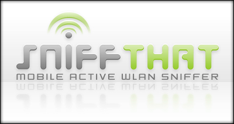

# ~~Attention, SniffThat will restart:~~
~~SniffThat will be restarted. Before doing so I want to collect all feature requests from the users out there to proof if they can be added to the new version.~~
~~For input check this post: [discussion:45184](discussion_45184)~~
Due to the lack of interest there won't be a restart.

# SniffThat

SniffThat is a pocket pc software based on the Compact Framework 2.0.

SniffThat allows to scan for wireless access points and combine this information with the current GPS position of the device.

It is plugin based and therefore supports custom plugins to do whatever the plugin likes to do with the access point and / or Gps Information.

[Screenshots](Screenshots)

## Releases

Releases always consist of these items:
* **SniffThat Setup**
	* Desktop Setup that installs SniffThat over ActiveSync on the device
	* contains SniffThat and the .NET Compact Framework 2.0 SP1
* **SniffThat CAB File**
	* The SniffThat CAB file to install directly on the device
	* doesn't contain the .NET Framework
* ****.ogm files**
	* contain information about geographical positions
	* at the moment only for Germany such an ogm file exists
* **LameSoft.Mobile.Gps Library**
	* Also contained in the SniffThat Setups but released here as an extra download
	* Provides access to Gps Data on the mobile device

## Contribute

If you want be part of this project simply send a mail to [mlamers@gmx.de](mailto:mlamers@gmx.de).
Please note that contributors that don't actively take part on this project will be removed from the list. So please try to contribute at least once per month.

## Requirements

To compile the SniffThat solution you need the following:

* Visual Studio 2005 (Standard or above to manage Compact Framework applications)
* [Team Explorer](http://www.codeplex.com/CodePlex/Wiki/View.aspx?title=Installing%20Team%20Explorer)
* [Windows Mobile 5.0 SDK for Pocket PC](http://www.microsoft.com/downloads/details.aspx?FamilyID=83A52AF2-F524-4EC5-9155-717CBE5D25ED&displaylang=en)
* [Windows Mobile 5.0 SDK for Smartphone](http://www.microsoft.com/downloads/details.aspx?familyid=DC6C00CB-738A-4B97-8910-5CD29AB5F8D9&displaylang=en)
* [Nullsoft Scriptable Install System](http://nsis.sourceforge.net/Main_Page) to build the setup
* [NUnit](http://www.nunit.org/)
* (optional) [TestDriven.NET](http://www.testdriven.net/) for NUnit IDE Integration
* (optional) [HM NIS EDIT](http://hmne.sourceforge.net/) to edit the installer build script

## Rules

Please follow these rules when working on SniffThat:

* Every CheckIn needs a comment
* Update the comment header in the files you have edited
* Only check in compilable source code
* Run all tests (if there are some) before checking in

## Coding Conventions

* Properties in PascalCase
* Methods in PascalCase
* Method parameters in camelCase
* private fields like "_PrivateField"
* Class names begin with a capital letter
* Interfaces have a "I" prefix